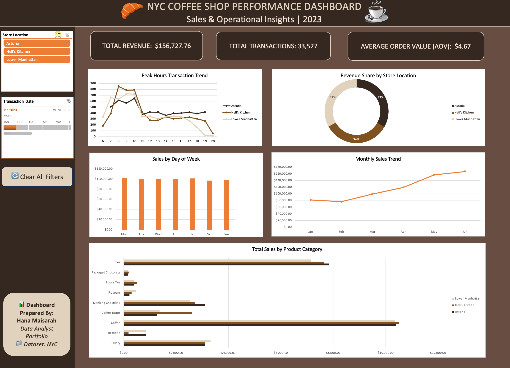

# ☕ NYC Coffee Shop Performance Dashboard (2023)
> An end-to-end data analytics and interactive dashboard project built using Microsoft Excel to analyze sales trends, operational peak hours, and product category performance for a coffee shop chain in New York City.

---

## 🖼️ Dashboard Preview



---

## 📌 Executive Summary & Business Objectives

This project analyzes transactional data from three coffee shop locations in NYC (**Astoria**, **Hell's Kitchen**, and **Lower Manhattan**). The primary goal is to provide store managers and business owners with actionable insights regarding revenue drivers, peak operational hours, and customer purchasing patterns to optimize staffing and stock inventory.

### Key Questions Addressed:
1. What are the total revenue, transaction counts, and Average Order Value (AOV) across stores?
2. When are the peak operational hours during the day?
3. Which product categories generate the highest sales revenue?
4. How does revenue performance vary by store location and day of the week?

---

## 📊 Key Business Insights

* **Morning Peak Demand (8:00 AM – 10:00 AM):** Transactions spike drastically during early morning hours, accounting for the highest volume of daily sales across all three branches.
* **Top Revenue Drivers:** **Coffee** and **Tea** categories dominate total sales volume, followed by **Bakery** items and **Drinking Chocolate**.
* **Equitable Revenue Distribution:** Revenue share is evenly split among the three locations (~33% Astoria, ~34% Hell's Kitchen, ~33% Lower Manhattan), indicating consistent brand performance across locations.
* **Balanced Daily Sales:** Weekly sales remain steady from Monday through Sunday, showing strong baseline customer retention throughout the week.

---

## 🛠️ Technical Architecture & Features

This interactive dashboard was designed following modern UI/UX data visualization principles:

* **Data Cleaning & Engineering:** Processed raw transaction timestamps into structured time attributes (`Hour`, `Day`).
* **Dynamic KPI Cards:** Displays core metrics (*Total Revenue*, *Total Transactions*, *Average Order Value*) using dynamic formulas.
* **Interactive Navigation Sidebar:**
  * **Location Slicer:** Filters data instantly by store location.
  * **Timeline Control:** Allows dynamic filtering by date ranges and months.
  * **VBA Macro Filter Reset:** Custom `Clear All Filters` button for seamless user experience.
* **Executive 6-Grid Chart Layout:**
  * **Peak Hours Trend** (Line Chart)
  * **Revenue Share by Location** (Doughnut Chart)
  * **Sales by Day of Week** (Bar Chart, calibrated $0–$120k scale)
  * **Monthly Sales Trend** (Line Chart)
  * **Product Category Breakdown** (Horizontal Bar Chart)

---

## 💻 VBA Code for Macro Button

A custom VBA macro was integrated to clear all active slicers and timelines with a single click:

```vba
Sub ClearAllFilters()
    Dim sc As SlicerCache
    On Error Resume Next
    For Each sc In ActiveWorkbook.SlicerCaches
        sc.ClearManualFilter
    Next sc
    On Error GoTo 0
End Sub
```

---

## 📁 Repository Structure

```text
├── NYC_Coffee_Shop_Dashboard.xlsm   # Final Interactive Excel Dashboard (Macro-Enabled)
├── dashboard_preview.png            # High-resolution dashboard screenshot
├── Coffee Shop Sales.csv            # Raw dataset
└── README.md                        # Project documentation & business insights
```

---

## 👩‍💻 Author & Contact

**Hana Maisarah**  
*Data Analyst Portfolio Project*  
* **LinkedIn:** https://www.linkedin.com/in/hana-maisarah-309a33294/
* **Email:** hanamaisarah2004@gmail.com

---
*If you find this project insightful, feel free to give it a ⭐️ star!*
